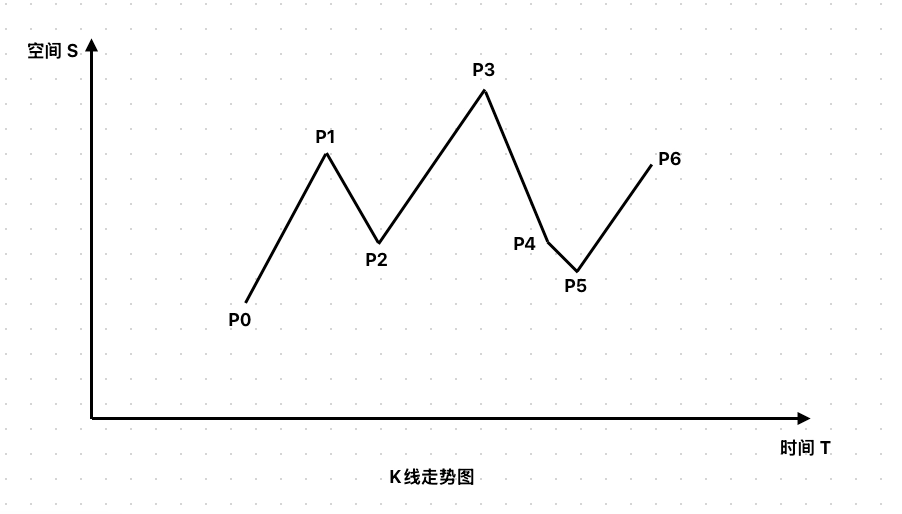

# MT5TradeAlgo

本仓库当前的主策略是 `mt5/P4PatternStrategy.mq5`。它会在 MT5 中按定时器轮询多个品种，基于 P4 形态寻找方向化机会，并自动管理强止损、条件触发的弱止损、`P5/P6` 激活后的唯一止盈，以及止盈/止损后的观察窗口。

当前实现要求交易账户为 `hedging` 模式。EA 会按独立持仓 ticket 记录每一笔入场对应的模式快照、`P5/P6` 演化、止盈止损和观察窗口；如果账户是 `netting` 模式，这套管理模型将不成立。

这份说明以当前代码实现为准，结合 `prd/Mt5交易策略_P4Entry.md` 的模式图和已归档的 OpenSpec 变更整理而成，适合第一次接触这份策略代码的人快速理解“它现在到底怎么工作”。

## 模式图

下图来自 PRD，用来说明 P0 到 P6 的点位关系：

在当前实现里，点位取值由 `InpTradeDirectionMode` 控制：

- `LONG_ONLY`：仅搜索并交易多头模式。`P0/P2/P5=low`，`P1/P3/P6=high`，`P4=实时 ask`
- `SHORT_ONLY`：仅搜索并交易空头镜像模式。`P0/P2/P5=high`，`P1/P3/P6=low`，`P4=实时 bid`
- `BOTH`：同时评估多头和空头候选；检测、下单和运行时门控仍按同一 `symbol + timeframe` 共享

当前 `BOTH` 模式的实现还有一个重要取舍：检测器内部会同时评估多头和空头，但同一时刻最终只保留一个候选继续进入后续门控与下单流程，而不会把多空两份最终候选都显式保留下来。后者被视为后续可优化项，用于增强回测解释性和实盘排障能力。

代码已经不再使用最早 PRD 里的 `PointValueTypeEnum` 全局取值模式，而是按方向和点位角色固定取价。

## 变量定义

代码中沿用 PRD 的核心结构变量，并通过 `direction` 做镜像归一化。设 `dir=+1` 表示多头，`dir=-1` 表示空头：

- `b1 = dir * (P2 - P0)`
- `a = dir * (P1 - P2)`
- `b2 = dir * (P3 - P1)`
- `c = dir * (P3 - P4)`
- `d = dir * (P4 - P5)`
- `e = dir * (P6 - P5)`
- `r1 = c / (a + b1 + b2)`
- `r2 = a / (a + b1)`

时间变量定义如下：

- `t1 = T(P0,P1)`
- `t2 = T(P1,P2)`
- `t3 = T(P2,P3)`
- `t4 = T(P3,P4)`
- `t5 = T(P4,P5)`
- `t6 = T(P5,P6)`
- `triggerPatternTotalTimeMinute = t1 + t2 + t3 + t4`

其中：

- `a`、`b1`、`b2` 用于判断历史骨架是否合格
- `c`、`r1`、`t4` 用于判断实时 `P4` 触发是否成立
- `d`、`e` 只在开仓后用于弱止损激活
- `r2`、`sspanmin` 目前主要用于日志和结构记录，不直接参与最终入场门控

## 策略实现思路

### 1. 先在已收盘 K 线中寻找历史骨架 `P0-P3`

策略每次轮询某个品种时，会先读取最近 `InpLookbackBars` 根已收盘 K 线，然后在最近窗口内枚举候选的 `P0/P1/P2/P3` 组合。

相邻点之间允许跨越多根 K 线，但每一段都必须满足最小/最大跨度约束。这里的 `SpanKNumber` 只计算两点之间“中间间隔”的 K 线数量，不包含起点和终点所在的两根 K 线：

- `P0 -> P1`：`InpAdjustPointMinSpanKNumber <= span <= InpAdjustPointMaxSpanKNumber`
- `P1 -> P2`：`InpAdjustPointMinSpanKNumber <= span <= InpAdjustPointMaxSpanKNumber`
- `P2 -> P3`：`InpAdjustPointMinSpanKNumber <= span <= InpAdjustPointMaxSpanKNumber`
- `P3 -> 当前触发段`：`InpAdjustPointMinSpanKNumber <= span <= InpAdjustPointMaxSpanKNumber`

同时，历史骨架必须满足方向化的基础拓扑关系：

- 多头：`P1 > P0`、`P2 > P0`、`P2 < P1`、`P3 > P1`
- 空头：`P1 < P0`、`P2 < P0`、`P2 > P1`、`P3 < P1`

除了这些点位关系，历史骨架现在还必须满足“端点就是该段极值”的线段约束，且默认允许并列极值。这些约束由 `InpRequiredSwingExtremaSegments_Pre0P0_P0P1_P1P2_P2P3_P3P4` 控制，默认值为 `"true,true,true,true,true"`：

- `Pre0P0`：控制 `Pre0 -> P0` 段是否要求两个端点达到该段极值
- `P0P1`、`P1P2`、`P2P3`：分别控制对应历史骨架段是否要求两个端点达到该段极值
- `P3P4`：只控制 `P3` 是否达到 `P3 -> P4` 段极值，不要求 `P4` 成为该段另一端极值
- 多头启用时：`P0 -> P1`、`P1 -> P2`、`P2 -> P3` 依次要求 `low/high`、`high/low`、`low/high`
- 空头启用时：同三段按镜像要求 `high/low`、`low/high`、`high/low`

### 2. 再对历史骨架做结构过滤

历史骨架不是只要长得像就可以，当前代码会继续检查这些条件：

- `CondA`：`b1 / b2` 必须落在 `[InpCondAXMin, InpCondAXMax]`
- `a` 的最小空间限制：`a >= InpP1P2AValueSpaceMinPriceLimit`
- `P1 -> P2` 的最小持续 K 线数：`pointSpans[1] + 2 >= InpP1P2AValueTimeMinKNumberLimit`
- `b1 + b2` 的区间限制：
  - 下限：`b1 + b2 >= InpBSumValueMinRatioOfAValue * a`
  - 上限：`b1 + b2 <= InpBSumValueMaxRatioOfAValue * a`
- `Pre0` 前置 move 先决条件：
  - 只有在 `InpPreCondEnable = true` 时才启用
  - 在 `P0` 之前最近 `InpPreCondPriorMoveLookbackBars` 根 K 线内，必须存在一个 `Pre0`
  - `Pre0 -> P0` 的方向性 move 要大于 `InpPreCondPriorMoveMinRatioOfStructure * (a + b1)`
  - `Pre0` 与 `P0` 之间的中间 K 线数量必须 `>= InpPreCondPriorMoveMinBarsBetweenPre0AndP0`
  - 只有当 `InpRequiredSwingExtremaSegments_Pre0P0_P0P1_P1P2_P2P3_P3P4` 的 `Pre0P0` 位置为 `true` 时，才要求多头下 `Pre0` 达到该段最高点、`P0` 达到该段最低点；空头按镜像要求 `Pre0` 达到该段最低点、`P0` 达到该段最高点；如果段内有并列极值，端点只要达到该极值就算通过

只有通过这些检查的 `P0-P3`，才会进入缓存，等待实时 `P4` 触发。

### 3. 用实时价格判断 `P4` 是否触发

历史骨架准备好后，策略不会等当前 K 线收盘，而是直接用方向对应的实时价格作为 `P4`：

- 多头：`P4 = 当前 ask`，`c = P3 - P4`
- 空头：`P4 = 当前 bid`，`c = P4 - P3`

实时触发时还要满足：

- `CondB`：`c / (a + b1 + b2) >= InpP3P4MoveMinRatioOfStructure`
- `CondC`：`t4 < InpCondCZ * (t1 + t2 + t3)`
- 多头要求 `P4 < P3`，且只有在 `InpRequiredSwingExtremaSegments_Pre0P0_P0P1_P1P2_P2P3_P3P4` 的 `P3P4` 位置为 `true` 时，才要求 `P3` 达到 `P3 -> P4` 整段最高点
- 空头要求 `P4 > P3`，且只有在 `P3P4=true` 时，才要求 `P3` 达到 `P3 -> P4` 整段最低点
- 如果段内出现与 `P3` 相同的并列极值，仍算通过

如果同一时刻有多个候选骨架都能触发，代码优先选择：

- `P3` 时间更晚的候选
- 如果 `P3` 时间相同，则多头优先 `P4` 更低的候选，空头优先 `P4` 更高的候选

### 4. 入场前还要经过运行时门控

即使模式成立，也不一定马上下单。当前代码还会拦截以下情况：

- 同一品种刚刚在当前 `P4` 所在 bar 成功开过仓
- 该品种刚刚止盈，仍处于 `InpProfitObservationBars` 定义的观察窗口内
- 该品种刚刚强止损或弱止损，仍处于 `InpStopObservationBars` 定义的观察窗口内
- 当前候选与“已经成功开过仓的历史骨架”共享同角色的 `P0/P1/P2/P3` 任一点
- 当前由本 EA 管理的该品种持仓数已经达到 `InpMaxPositionsPerSymbol`
- 多头方向下当前 `bid` 已经低于强止损价，或已高于激活后的止盈位
- 空头方向下当前 `ask` 已经高于强止损价，或已低于激活后的止盈位

只要止盈观察窗口或止损观察窗口任意一个仍未结束，就不会开新单。通过全部门控后，策略才会按方向发出市价买单或卖单。

## 开仓、止盈和止损

### 开仓

- 多头匹配：`trade.Buy(...)`
- 空头匹配：`trade.Sell(...)`
- 参考入场价：`referenceEntryPrice = P4`
- 实际成交价：由 MT5 按实时市场价成交

因此，`P4` 是策略计算用的参考触发价，不保证与实际成交价完全相同。

### 强止损

当前代码中的强止损不是 PRD 最初写的固定入场价差公式，而是直接放在：

- `hardLossPrice = P0`

持仓后：

- 多头用实时 `bid` 判断，`bid <= hardLossPrice` 即强止损
- 空头用实时 `ask` 判断，`ask >= hardLossPrice` 即强止损

### 止盈激活

当前实现里，开仓后不会立刻设置止盈位：

- 开仓时只有 `hardLossPrice = P0`
- `profitPrice` 在首次合格 `P5/P6` 出现前处于未激活状态

也就是说，如果一笔单子始终没有走出合格 `P5/P6`，它将只受强止损管理，不会有 `profit_target`。

### 弱止损

弱止损不是开仓就有，而是开仓后继续基于该持仓之后的 tick 顺序追踪 `P5/P6`：

- `P5`：只允许从 `tP4` 之后的后续 tick 中确认
- `P6`：只允许从 `tP5` 之后的后续 tick 中确认
- `P4`、`P5`、`P6` 可以落在同一根 K 线上，也可以落在不同 K 线上，但必须满足严格顺序 `tP4 < tP5 < tP6`

找到后计算方向化变量：

- 多头：`d = P4 - P5`，`e = P6 - P5`
- 空头：`d = P5 - P4`，`e = P5 - P6`

只有满足下面条件，弱止损和止盈才会首次激活：

- `e >= InpP5P6ReboundMinRatioOfP3P5Drop * (c + d)`

如果当前时刻存在多个满足条件的 `P5` 候选，代码会一次性选择：

- 多头：价格最低的 `selectedP5`
- 空头：价格最高的 `selectedP5`

随后设置：

- `softLossPrice = InpSoftLossC * selectedP5`
- 多头：`profitPrice = selectedP5 + InpP5AnchoredProfitC * (a + b1 + b2)`
- 空头：`profitPrice = selectedP5 - InpP5AnchoredProfitC * (a + b1 + b2)`

默认 `InpP5AnchoredProfitC = 1.0`。

一旦首次激活完成，这两个价位会被冻结，后续即使再出现新的 `P5/P6` 组合，也不会继续改写。

同一根 K 线里如果在 `P4` 之前已经出现过更早的低点，或者在 `P5` 之前已经出现过更早的高点，代码也不会直接把这两个 bar 级极值误当成 `P5/P6`；只有在 tick 顺序上能证明发生在 `P4` 之后或 `P5` 之后的事件才会被接受。

触发比较侧也按方向镜像：

- 多头：`bid <= softLossPrice` 触发 `soft_stop`，`bid >= profitPrice` 触发 `profit_target`
- 空头：`ask >= softLossPrice` 触发 `soft_stop`，`ask <= profitPrice` 触发 `profit_target`

### 观察窗口

当前实现有两套互相独立的观察窗口，且都只影响新开仓，不影响已有持仓继续止盈止损：

- 止盈观察窗口：持仓因 `profit_target` 平仓后启动，长度由 `InpProfitObservationBars` 控制
- 止损观察窗口：持仓因 `hard_stop` 或 `soft_stop` 平仓后启动，长度由 `InpStopObservationBars` 控制

如果同一品种同时存在止盈观察窗口和止损观察窗口，则只要任意一个窗口尚未结束，就不能再开新单。

## 参数说明

### 运行与交易参数

| 参数 | 默认值 | 含义 | 如何参与计算 |
| --- | --- | --- | --- |
| `InpSymbols` | `"XAUUSD"` | 要扫描的品种列表，分号分隔 | `OnTimer()` 逐个轮询 |
| `InpTF` | `PERIOD_M10` | 形态识别周期 | 所有 K 线和时间跨度都基于该周期 |
| `InpTimerMillSec` | `100` | 定时器轮询间隔，毫秒 | 控制扫描频率 |
| `InpMagic` | `9527001` | EA 魔术号 | 用来识别本 EA 的持仓 |
| `InpComment` | `"P4PatternStrategy"` | 订单备注前缀 | 用于识别和日志追踪 |
| `InpFixedLots` | `0.05` | 固定下单手数 | 多头用于 `trade.Buy()`，空头用于 `trade.Sell()` |
| `InpTradeDirectionMode` | `LONG_ONLY` | 方向模式 | 控制检测和交易允许的方向，取值为 `LONG_ONLY / SHORT_ONLY / BOTH` |
| `InpMaxPositionsPerSymbol` | `1` | 单品种最大并行持仓数 | 超限时阻止开仓 |
| `InpSlippagePoints` | `20` | 允许的价格偏差点数 | 用于交易请求的成交偏差控制 |
| `InpProfitObservationBars` | `10` | 止盈后观察窗口 bar 数 | 观察期内阻止新开仓 |
| `InpStopObservationBars` | `10` | 止损后观察窗口 bar 数 | `hard_stop` 或 `soft_stop` 后观察期内阻止新开仓 |
| `InpLookbackBars` | `300` | 回看已收盘 K 线数量 | 限制历史骨架搜索范围 |
| `InpAdjustPointMinSpanKNumber` | `3` | 相邻点之间最少中间 K 线数 | 限制 `P0-P4` 各段跨度下限 |
| `InpAdjustPointMaxSpanKNumber` | `35` | 相邻点之间最多中间 K 线数 | 限制 `P0-P4` 各段跨度上限 |

### 历史骨架过滤参数

| 参数 | 默认值 | 含义 | 如何参与计算 |
| --- | --- | --- | --- |
| `InpCondAXMin` | `0.75` | `CondA` 下限 | 要求 `b1 / b2 >= InpCondAXMin` |
| `InpCondAXMax` | `1.25` | `CondA` 上限 | 要求 `b1 / b2 <= InpCondAXMax` |
| `InpP1P2AValueSpaceMinPriceLimit` | `0.0` | `a` 的最小价格幅度 | 要求 `a >= 该值` |
| `InpP1P2AValueTimeMinKNumberLimit` | `1` | `P1->P2` 最小总 K 线数 | 要求 `pointSpans[1] + 2 >= 该值` |
| `InpBSumValueMinRatioOfAValue` | `2.0` | `b1+b2` 相对 `a` 的最小倍数 | 要求 `b1+b2 >= 该值 * a` |
| `InpBSumValueMaxRatioOfAValue` | `10.0` | `b1+b2` 相对 `a` 的最大倍数 | 要求 `b1+b2 <= 该值 * a` |
| `InpPreCondEnable` | `false` | 是否启用 `Pre0` 前置 move 条件 | 关闭时跳过 `Pre0` 搜索与过滤，也不画 `Pre0` 标注 |
| `InpPreCondPriorMoveLookbackBars` | `30` | `Pre0` 前置 move 回看窗口 | 在 `P0` 之前多少根 K 线内寻找 `Pre0` |
| `InpPreCondPriorMoveMinRatioOfStructure` | `0.45` | `Pre0->P0` 最小方向性 move 系数 | 要求方向性 move `> 该值 * (a+b1)` |
| `InpPreCondPriorMoveMinBarsBetweenPre0AndP0` | `0` | `Pre0` 与 `P0` 最少间隔 bar 数 | 约束前置 move 与骨架之间的距离 |
| `InpRequiredSwingExtremaSegments_Pre0P0_P0P1_P1P2_P2P3_P3P4` | `"true,true,true,true,true"` | 相邻段整段极值开关 | 顺序固定为 `Pre0P0/P0P1/P1P2/P2P3/P3P4`；前四位控制对应线段两个端点，`P3P4` 只控制 `P3` |

### 实时触发与出场参数

| 参数 | 默认值 | 含义 | 如何参与计算 |
| --- | --- | --- | --- |
| `InpP3P4MoveMinRatioOfStructure` | `0.44` | `CondB` 阈值 | 要求 `c / (a+b1+b2) >= 该值` |
| `InpCondCZ` | `1.0` | `CondC` 系数 | 要求 `t4 < 该值 * (t1+t2+t3)` |
| `InpP5P6ReboundMinRatioOfP3P5Drop` | `0.55` | 弱止损激活阈值 | 要求 `e >= 该值 * (c+d)` |
| `InpSoftLossC` | `1.0` | 弱止损价系数 | `softLossPrice = 该值 * selectedP5` |
| `InpP5AnchoredProfitC` | `1.0` | 唯一止盈系数 | 首次 `P5/P6` 激活后，多头加到 `selectedP5`，空头从 `selectedP5` 向下减去 |
| `InpEnableExactSearchCompare` | `false` | 调试开关 | 打开后会对比缓存搜索和精确搜索结果，仅用于诊断 |

## 当前实现与最初 PRD 的主要差异

为了避免误读，下面这几条最值得先记住：

- 当前实现保留了 PRD 的点位图和主结构，但具体过滤规则已经按归档 spec 演化
- `PointValueTypeEnum` 已移除，点位取价改为“按方向和点位角色固定取价”
- `CondB` 已不是 PRD 最初的 `r1 = y * r2` 匹配，而是直接要求 `c/(a+b1+b2)` 达到最小阈值
- 独立的旧 `CondD` 不再参与过滤；代码里 `condD` 仅保留为结构字段，当前恒为 `true`
- 旧的 `tspanmin` 门槛不再作为入场条件，当前改为 `a` 的最小空间、`P1-P2` 最小时长、`b1+b2` 区间和 `Pre0` 前置 move 先决条件
- 强止损改为 `P0`
- 开仓时不再设置初始止盈；只有首次合格 `P5/P6` 出现后才会激活唯一止盈位
- 首次 `P5/P6` 激活后，多头基于最低合格 `P5`，空头基于最高合格 `P5`
- 弱止损激活条件改为 `e >= 阈值 * (c+d)`
- 止盈后和止损后都有独立观察窗口，且任一窗口有效时都禁止新开仓

如果你要调参，建议先按“当前代码公式”理解，不要直接沿用最初 PRD 里的旧公式。

## 日志怎么看

策略默认只突出成功入场日志，重点字段包括：

- 成功入场日志 `ENTRY_P4`：默认只保留这一条核心摘要，输出 `symbol`、`ticket`、`direction`、`p4_bar`、成交价、`hard_loss`、图形标注状态，以及本次实际使用的 `P0-P4` 时间和价格
- 弱止损首次激活日志 `ACTIVATE_P56`：输出 `P4/P5/P6` 的 tick 级时间和价格，以及 `entry_bar_extreme_at_p4`、`bar_extreme_at_p5` 两个诊断字段，用来确认同 bar 场景下没有把更早发生的 bar 级极值误判成 `P5/P6`
- `annotation=drawn`：表示策略已在一个已打开且匹配 `symbol + InpTF` 的图表上画出该次入场的模式对象；如果后续首次出现合格 `P5/P6`，同一组对象会继续补画
- `annotation=no_matching_chart`：表示本次入场成功，但当前没有打开匹配的图表，所以没有绘图
- `annotation=draw_failed`：表示交易成功，但图形对象创建失败；不会影响持仓管理

默认不再打印常规阻止日志和例行 `EXIT` 摘要，因此 Experts 输出会明显更短，更适合直接盯入场和 `P5/P6` 激活。

## 图上怎么看模式

如果你想直接在图中看到某次入场对应的是哪组模式，需要先满足两个条件：

1. 打开该入场品种对应的图表
2. 图表周期与 `InpTF` 一致

满足后，策略会在成功入场时于该图上绘制：

- 启用并匹配到前置条件时，显示 `Pre0`；否则仍正常显示 `P0/P1/P2/P3/P4` 点位标记和相邻连线
- `P4` 入场高亮箭头，多头和空头使用不同方向/颜色
- 强止损水平线
- `Pre0-P0` move 值、`b1`、`a`、`b2`、`c` 数值标注；其中 `Pre0-P0` 只在启用且匹配到 `Pre0` 时显示

如果后续该持仓首次形成合格 `P5/P6`，策略会在同一组对象里继续补充：

- `P5/P6` 点位标记和 `P4-P5-P6` 连线
- 弱止损水平线

点位颜色固定且跨交易保持一致，便于快速辨认：

- `Pre0`、`P0`、`P1`、`P2`、`P3`、`P4`、`P5`、`P6` 都有各自固定颜色

对象名会带上 `symbol`、`timeframe`、`direction`、`ticket` 和 `p4_bar_time`，所以同一图表上多次入场不会互相覆盖，也可以从对象名反查到对应信号。

## 首次运行

第一次在 MT5 中使用这份策略时，建议按这个顺序操作：

1. 在 MetaEditor 中编译 `mt5/P4PatternStrategy.mq5`。
2. 把 EA 挂到任意一个图表上即可，实际扫描对象由 `InpSymbols` 决定，不依赖挂载图表本身的品种。
3. 设置 `InpSymbols`、`InpTF`、`InpFixedLots` 等运行参数，确认目标品种已在 Market Watch 中可用。
4. 如果想看图上模式，提前打开你关心品种且周期等于 `InpTF` 的图表。
5. 打开 Experts / Journal，先确认初始化日志，再观察 `ENTRY_P4` 是否清楚列出 `P0-P4` 点位，并检查图表上是否出现对应的 `Pre0-P4`、高度值和强止损标注；若后续触发合格 `P5/P6`，再确认图上是否补出 `P5/P6` 和弱止损位。
6. 实盘前先用 Strategy Tester 回测，重点检查止盈/止损观察窗口、共享骨架锁、多空共享的 `P4` bar 锁，以及首次 `P5/P6` 激活后多头最低 `P5` / 空头最高 `P5` 的选择是否符合预期；回测结束时再确认 Experts / Journal 中是否出现中文 `回测总结`，其中会打印总收益率、模式匹配次数、模式匹配胜率等汇总指标。

## 使用建议

第一次运行建议按下面的顺序理解和验证：

1. 先对照上面的模式图，看懂 `P0-P6` 在当前代码中的取价方式。
2. 再重点理解四组门槛：`CondA`、`a/P1P2/bSum` 结构门槛、`Pre0` 前置 move、`P4` 实时触发。
3. 最后再调交易参数，特别是 `InpProfitObservationBars`、`InpStopObservationBars`、`InpP5P6ReboundMinRatioOfP3P5Drop`、`InpP5AnchoredProfitC` 和 `InpMaxPositionsPerSymbol`。

如果需要回测，可直接使用 `mt5/P4PatternStrategy.mq5`，并通过 MT5 Strategy Tester 观察 `ENTRY_P4` 日志是否准确对应到图上的 `Pre0-P4` 标注，以及后续 `P5/P6` 与止损线是否按持仓演化补画。回测 run 结束后，策略会额外打印一条 `回测总结`，用于快速查看 `总收益率`、`模式匹配次数`、`已闭仓笔数`、`模式匹配胜率` 等核心结果。
